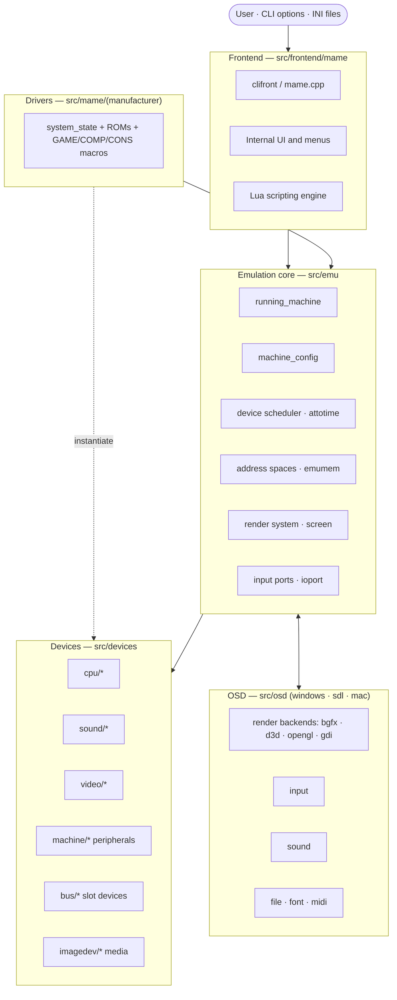
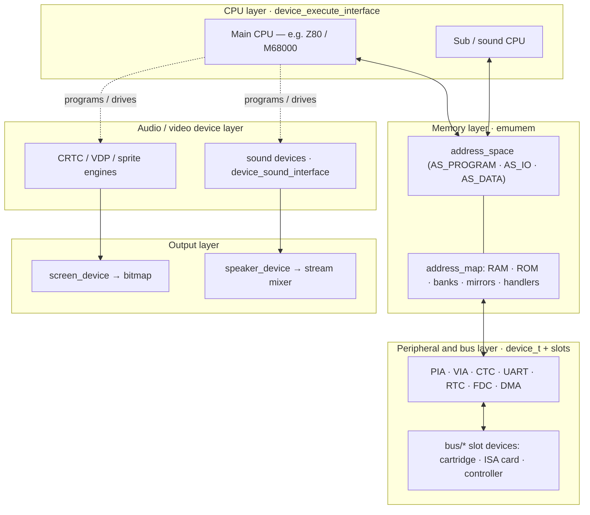
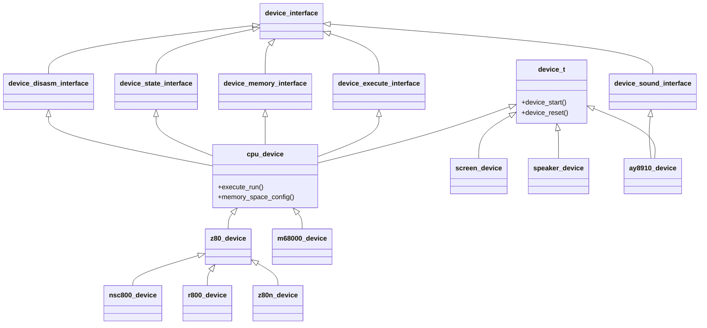
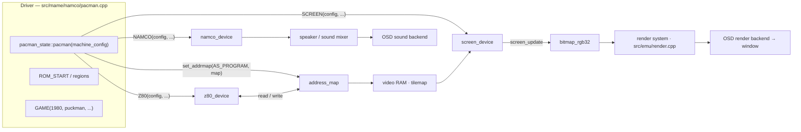

# MAME Architecture Overview

A developer-oriented map of how MAME is put together: the major layers, the
device model that everything is built on, how a driver assembles an emulated
machine, and a representative (not exhaustive) catalog of the hardware MAME
emulates.

> **Scope.** MAME emulates *thousands* of systems with hundreds of CPU families,
> sound chips, and peripherals. This document names a handful of well-known
> examples per category to orient you; it does **not** try to list everything.
> To enumerate the full, always-current set, build MAME and run
> `mame -listxml` (systems + devices), `mame -listdevices`, or
> `mame -listsource`.

---

## 1. The one idea to internalize: everything is a device

Nearly every piece of emulated hardware in MAME — CPUs, sound chips, video
chips, peripheral controllers, slot cards, even screens and speakers — is a C++
class derived from **`device_t`** (`src/emu/device.h`). Capabilities are added
through **device interfaces** (mix-in base classes named `device_*_interface`,
defined in the `src/emu/di*.h` files): execution, memory, sound, graphics,
state, disassembly, and so on.

A *driver* is just code that instantiates a set of devices, wires them together
in a `machine_config`, and registers the result as a runnable system. The
portable core never talks to the host OS directly — that is the job of the
**OSD** (OS-Dependent) layer.

---

## 2. System architecture

The top-level pieces and how they relate. The frontend drives the core; the
core orchestrates devices; drivers register and compose those devices; the OSD
abstracts the host machine.

| Layer | Source | Responsibility |
|---|---|---|
| **Frontend** | `src/frontend/mame` | Command-line front end (`clifront`), internal UI/menus, Lua scripting, auditing, info/XML export. |
| **Core** | `src/emu` | Device scheduling, timing (`attotime`), address spaces (`emumem`), I/O ports, save state, render system, ROM loading, software lists. |
| **Devices** | `src/devices` | Reusable hardware building blocks (CPUs, sound, video, peripheral chips, buses, media). |
| **Drivers** | `src/mame/<manufacturer>` | Per-system code that composes devices into a machine and registers it. ~360 manufacturer directories. |
| **OSD** | `src/osd` | Host abstraction: video/render output, input, sound, files, fonts, MIDI, debugger UI. Backends for Windows, SDL, macOS. |

---

## 3. The layered hardware stack

Inside a single emulated machine, the devices form a stack: CPUs execute and
reach through **address spaces** to RAM/ROM and memory-mapped peripherals;
peripherals and slot devices hang off those spaces; video and sound devices
produce frames and audio streams that flow out to the screen and speakers.

**Memory model.** Each memory-having device declares one or more
`address_space`s (commonly `AS_PROGRAM`, `AS_IO`, `AS_DATA`). A driver populates
each space with an `address_map` (`src/emu/addrmap.h`) that binds address ranges
to RAM, ROM, banks, or read/write handler delegates. The `emumem` subsystem
(`src/emu/emumem*.cpp` — the large family of `emumem_he*` files) implements the
high-performance dispatch that turns a CPU access into the right handler.

---

## 4. The device model & class hierarchy

`cpu_device` is the canonical example of how interfaces compose: it is a
`device_t` that *also* implements the execute, memory, state, and disassemble
interfaces. Concrete CPUs derive from it, and chip *variants* derive from their
parent CPU rather than duplicating it. Sound, video, and other devices follow
the same pattern with their own interfaces.

- **`device_t`** (`src/emu/device.h`) — base of everything; defines lifecycle
  hooks (`device_start`, `device_reset`, clock/config changes).
- **`cpu_device`** (`src/emu/devcpu.h`) — `device_t` + execute + memory + state +
  disasm interfaces. Every CPU is a `<cpu>_device`.
- **Variants subclass their parent CPU** — e.g. `nsc800_device`, `r800_device`,
  `z80n_device` all derive from `z80_device`, overriding only what differs.
- **Device types** are exported with `DECLARE_DEVICE_TYPE` / `DEFINE_DEVICE_TYPE`
  — the handle a driver uses to instantiate the device.
- **Disassemblers** live in separate `*d.cpp/.h` files so the standalone
  `unidasm` tool can reuse them without the full emulation core.

---

## 5. Driver composition & signal flow

A driver (e.g. `src/mame/namco/pacman.cpp`) defines a `<system>_state` class with
a machine-config method that constructs and connects devices, declares ROM
regions, and ends with one or more registration macros — `GAME` / `GAMEL`
(arcade), `COMP` (computer), `CONS` (console), `SYST`. At runtime, the CPU reads
and writes through its address map; video RAM feeds the screen; the screen's
update produces a bitmap that flows through the render system to the OSD window;
sound devices feed the mixer and out to the OSD sound backend.

**Build registration.** New devices are declared in `scripts/src/*.lua` (via
`--@` selector comments); new systems must be listed in `src/mame/mame.lst`
(grouped under `@source:<path>.cpp` headers), with `tiny.lst` as the small-subset
equivalent. GENie auto-discovers each `src/mame/<manufacturer>/` directory as a
build library, so no per-driver build edits are needed beyond the list entry.

---

## 6. Supported hardware — representative catalog

Each table lists the source location, a count of what lives there, and a few
recognizable examples. **These are samples, not full lists** — see the
`-listxml` / `-listdevices` note at the top.

### Systems / drivers

Organized by manufacturer under `src/mame/` (~360 directories), spanning arcade
machines, home computers, consoles, and handhelds/calculators.

| Category | Example directories | Example systems |
|---|---|---|
| Arcade | `namco/` `sega/` `atari/` `capcom/` `konami/` `taito/` `snk/` | Pac-Man, Galaga, Asteroids, Street Fighter II (CPS), Neo Geo |
| Home computers | `apple/` `commodore/` `sinclair/` `acorn/` `amstrad/` `msx/` `pc/` | Apple II / Macintosh, C64 / Amiga, ZX Spectrum, BBC Micro, CPC, MSX, IBM PC |
| Consoles | `nintendo/` `sega/` `sony/` `nec/` `atari/` | NES / SNES / N64 / Game Boy, Master System / Genesis, PlayStation, PC Engine, 2600 / 7800 |
| Handhelds & calculators | `handheld/` `tiger/` `ti/` `casio/` `sharp/` | LCD handhelds, Tiger games, TI / Casio / Sharp calculators |

### CPUs — `src/devices/cpu/` (~210 families)

| Family dir | Notable members |
|---|---|
| `z80/` | Z80 and variants (NSC800, R800, Z80N) |
| `m6502/` | 6502 / 6510 / 65C02 family |
| `m68000/` | 68000 / 68010 / 68020 / ColdFire |
| `i386/` | x86 (386 → Pentium-class) |
| `arm7/` | ARM7 / ARM9 cores |
| `mips/` `powerpc/` `sh/` `sparc/` | RISC families (MIPS, PowerPC, SuperH, SPARC) |
| `nec/` | NEC V-series (V20/V30/V60) |
| `tms9900/` `tms320c1x/` `tms34010/` `tms57002/` | TI CPUs, DSPs, and the TMS34010 graphics processor |
| `h8/` `sm510/` | Renesas H8, Sharp SM510 (Game & Watch) |

### Sound — `src/devices/sound/` (~189 devices)

| Device | Role |
|---|---|
| `ymopm` (YM2151) · `ymopn` (YM2203/2608/2612) · `ymopl` (OPL family) | Yamaha FM synthesis |
| `ay8910` · `sn76496` | Classic PSG square-wave chips |
| `pokey` · `namco` · `nes_apu` | Atari POKEY, Namco WSG, NES APU |
| `qsound` · `es5506` · `spu` · `ymz280b` | Sample/ADPCM engines (Capcom QSound, Ensoniq, PS1 SPU) |
| `dac` | Generic DAC building block |

### Video — `src/devices/video/` (~166 devices)

| Device | Role |
|---|---|
| `mc6845` · `crtc_ega` | CRT controllers |
| `v9938` · `huc6270` · `ppu2c0x` | MSX VDP, PC Engine VDC, NES PPU |
| `315_5124` · `315_5313` | Sega SMS VDP / Genesis VDP |
| `hd44780` | Character LCD controller |
| `voodoo` | 3dfx Voodoo 3D accelerator |
| `bufsprite` | Buffered sprite RAM helper |

### Peripheral chips — `src/devices/machine/` (~569 devices)

| Device | Role |
|---|---|
| `6522via` · `6821pia` · `i8255` | Parallel I/O / peripheral adapters |
| `z80ctc` · `pit8253` | Counter/timer chips |
| `z80sio` · `ins8250` | Serial / UART controllers |
| `am9517a` | DMA controller |
| `mc146818` | Real-time clock + CMOS |
| `wd_fdc` · `upd765` | Floppy disk controllers |
| `nvram` · `eeprom` | Non-volatile storage helpers |

### Buses & slots — `src/devices/bus/` (~184 bus types)

| Bus dir | Role |
|---|---|
| `isa/` · `pci/` | PC expansion buses |
| `ata/` · `scsi/` | Storage interfaces |
| `centronics/` · `rs232/` | Parallel / serial ports |
| `nes/` · `vcs/` · `gameboy/` · `megadrive/` · `sega8/` | Console cartridge slots |
| `c64/` · `spectrum/` | Home-computer expansion slots |
| `neogeo/` | Neo Geo cartridge / system slots |

### Media / image devices — `src/devices/imagedev/`

Mountable media exposed through `device_image_interface`:

| Device | Media |
|---|---|
| `floppy` / `flopdrv` | Floppy disk drives |
| `harddriv` / `mfmhd` | Hard disks (incl. MFM) |
| `cdromimg` | CD-ROM images |
| `cassette` / `magtape` | Tape media |
| `cartrom` | Cartridge ROM images |
| `printer` / `midiin` / `midiout` | Printer and MIDI I/O |
| `snapquik` | Snapshot / quick-load |

### Displays & render output

The core represents a display as a `screen_device` (`src/emu/screen.h`) that
produces a bitmap each frame; the render system (`src/emu/render.cpp`) composites
screens with artwork and hands the result to an OSD backend.

| Display type | Notes |
|---|---|
| Raster | Standard scanline framebuffer displays (most systems). |
| Vector | Line-drawing displays (e.g. Asteroids, Star Wars) — `src/emu/rendlay`/vector support. |
| LCD / SVG | Segmented and dot-matrix LCDs; SVG artwork for handhelds/calculators. |
| Laserdisc | Video-disc overlay systems (e.g. Dragon's Lair). |

OSD render backends (`src/osd/modules/render/`): **bgfx** (cross-platform,
shader-based, default), **Direct3D** (`drawd3d`), **OpenGL** (`drawogl`),
**GDI** (`drawgdi`), and SDL drawing paths.

---

## Where to go next

- **Coding conventions, build commands, validation gates:** see
  [`CLAUDE.md`](../CLAUDE.md) at the repository root.
- **Full official documentation:** <https://docs.mamedev.org/> — including the
  C++ guidelines and the device/driver authoring guides.
- **Live, exhaustive hardware lists:** build MAME, then run `mame -listxml`,
  `mame -listdevices`, or `mame -listsource`.
